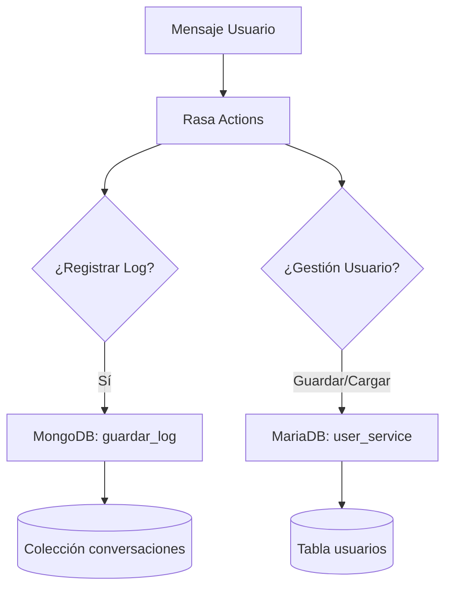

# Manual de Base de Datos — ThothBot

Referencia técnica del sistema de persistencia dual: **MariaDB** (Usuarios) y **MongoDB** (Logs de conversación).

---

## 1. Persistencia de Usuarios (MariaDB)

Sistema basado en **MariaDB** utilizando **SQLAlchemy ORM** para la gestión de usuarios registrados.

### Estructura de archivos
```
ThothBot/
├── models/
│   └── usuario.py              ← Definición de la tabla (ORM)
├── database/
│   ├── connection.py           ← Engine y sesión compartidos
│   └── setup_db.py             ← Script de inicialización
└── services/
    └── user_service.py         ← Lógica: guardar_o_actualizar_usuario / obtener_usuario
```

### Variables de Entorno (`.env`)
```env
MARIADB_USER=root
MARIADB_PASSWORD=tu_contraseña
MARIADB_HOST=localhost
MARIADB_PORT=3306
MARIADB_DB=thothbot_db
```

### El Modelo ORM (`models/usuario.py`)
Define la tabla `usuarios` con campos para `conversation_id`, `nombre`, `ciudad_origen`, `pais` y la fecha de registro.

---

## 2. Logs de Conversación (MongoDB)

Sistema NoSQL basado en **MongoDB** para el registro analítico de las interacciones del usuario.

### Estructura de archivos
```
ThothBot/
└── actions/
    └── db/
        └── mongo_logger.py     ← Conexión y función de guardado
```

### Implementación (`actions/db/mongo_logger.py`)
Utiliza la librería `pymongo` para conectarse a un servidor local.

**Configuración por defecto:**
- **Host:** `localhost`
- **Puerto:** `27017`
- **Base de datos:** `thothbot`
- **Colección:** `conversaciones`

**Función Principal:**
`guardar_log(intent, ciudad, mensaje)`: Registra el intent detectado, la ciudad de contexto, el mensaje original del usuario y un timestamp.

---

## 3. Guía de Inicio Rápido

### Inicializar MariaDB
Si es la primera vez que usas el bot, debes crear la base de datos y las tablas:
```bash
python database/setup_db.py
```

### Verificar MongoDB
Asegúrate de que el servicio de MongoDB esté corriendo en el puerto 27017:
```bash
sudo systemctl start mongodb
# O bien, si usas Docker
docker start thothbot-mongo
```

---

## 4. Resumen de Flujo de Datos



---

## Errores frecuentes

| Error | Sistema | Causa | Solución |
|-------|---------|-------|----------|
| `Access denied for user` | MariaDB | Credenciales incorrectas en `.env` | Revisar `.env` |
| `Can't connect to MySQL` | MariaDB | Servicio caído | `sudo systemctl start mariadb` |
| `ServerSelectionTimeout` | MongoDB | Servicio caído o puerto cerrado | `sudo systemctl start mongodb` |
| `ModuleNotFoundError` | Ambos | Librería faltante | `pip install pymysql sqlalchemy pymongo` |
