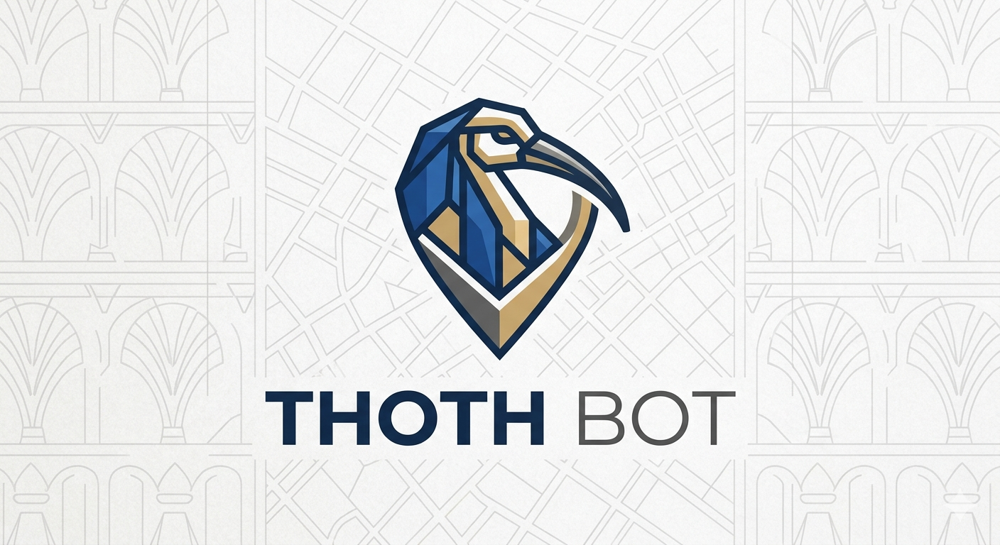
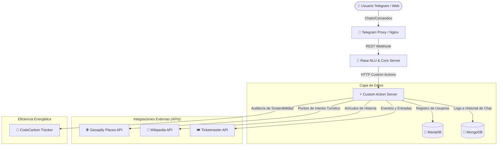

<p align="center">
  
</p>


# 🤖 ThothBot - Asistente Turístico Inteligente y Sostenible

[](https://rasa.com/)
[](https://www.docker.com/)
[](https://codecarbon.io/)
[](https://opensource.org/licenses/MIT)

**ThothBot** es un asistente conversacional (chatbot) inteligente y ecológicamente sostenible diseñado para guiar a turistas en tiempo real en cualquier ciudad del mundo. El bot permite registrar usuarios, buscar de forma inteligente monumentos principales, consultar eventos culturales y espectáculos a través de integraciones oficiales de API, y medir de forma transparente su huella de carbono.

Este proyecto ha sido desarrollado como **Trabajo de Fin de Grado (TFG)**, destacando por su arquitectura robusta de microservicios y su enfoque en **Green Computing (Sostenibilidad del Software)**.

---

## 🏛️ Arquitectura del Sistema (Multi-Contenedor)

El bot se despliega mediante **Docker Compose** en una red aislada compuesta por 5 microservicios coordinados:



---

## ✨ Características Principales

* **🗺️ Geocodificación y Búsqueda Global:** Traduce cualquier nombre de ciudad del mundo a coordenadas geográficas en tiempo real y encuentra sus monumentos más importantes de forma dinámica.
* **🛡️ Algoritmo de Filtrado Semántico Avanzado:** 
  * Excluye de forma inteligente el "ruido urbano" (como pequeñas placas conmemorativas de pared, señales de información o estatuas secundarias) mediante análisis de categorías de OpenStreetMap.
  * Implementa un sistema de puntuación (*Scoring*) que da máxima prioridad a los monumentos con artículos de Wikipedia/Wikidata y aplica boosts de relevancia a patrimonios de la humanidad.
* **🎟️ Integración Cultural en Vivo:** Conexión directa con la API de Ticketmaster para buscar conciertos, teatros o eventos deportivos en la ciudad consultada, facilitando enlaces directos de compra de entradas.
* **💾 Persistencia Dual Robusta:**
  * **MariaDB:** Registro formal de usuarios y perfiles turísticos personalizados.
  * **MongoDB:** Almacenamiento seguro del historial de conversaciones estructurado (chat logging) para análisis analítico posterior.
* **🌱 Sostenibilidad Nativa (Green Computing):** Monitoreo en caliente del consumo de CPU, RAM y GPU utilizando CodeCarbon, registrando las emisiones de $CO_2$ de cada consulta.

---

## 🌱 Green Computing: Auditoría de Huella de Carbono

ThothBot ha sido auditado energéticamente tanto en un entorno de desarrollo de alto rendimiento como en un servidor de producción en la nube (VPS). 

### Comparativa de Sostenibilidad (Ciclo Completo de Inferencia):

| Métrica | 💻 Entorno de Desarrollo (Workstation) | ☁️ Servidor de Producción (Cloud VPS) |
| :--- | :--- | :--- |
| **Procesador (CPU)** | AMD Ryzen 7 5800X (16 hilos) | Intel Core vCPU (4 hilos) |
| **Tarjeta Gráfica (GPU)** | NVIDIA GeForce RTX 5060 | Sin GPU Dedicada |
| **⚡ Consumo de Energía** | **0.0124 mWh** (Miliwatts-hora) | **0.0096 mWh** (Miliwatts-hora) |
| **🌱 Huella de $CO_2e$** | **11.94 mg de $CO_2$** | **4.28 mg de $CO_2$** |

> [!TIP]
> **Perspectiva Ecológica:**
> Preparar una taza de café en casa genera unos **15 gramos** de $CO_2$. ¡El servidor de producción de ThothBot puede procesar más de **3.500.000 de consultas turísticas** con esa misma huella de carbono! Esto califica al software como **Ecológicamente Neutro**.

---

## 🚀 Guía de Instalación y Despliegue Rápido

### 📋 Requisitos Completos del Sistema

Para ejecutar **ThothBot** de forma exitosa en entornos locales o de producción, asegúrate de cumplir con los siguientes requisitos:

#### 1. Requisitos de Software:
* **Sistema Operativo:** Linux (Ubuntu 20.04+, Debian 11+ recomendados), macOS (Intel o Apple Silicon con Docker Desktop) o Windows 10/11 (con WSL2 y Docker Desktop).
* **Entorno de Contenedores:** **Docker Engine v20.10+** y **Docker Compose v2.2.0+** (o el plugin integrado `docker compose`).
* **Entorno de Desarrollo (Opcional):** Python 3.10+ (requerido únicamente si deseas ejecutar los scripts de eficiencia energética y benchmarks como `benchmark_carbon.py` fuera del contenedor).

#### 2. Requisitos de Red y Puertos Libres:
Asegúrate de que los siguientes puertos de tu sistema host no estén ocupados por otros servicios para evitar colisiones:
* 🔌 **`5005`** - Puerto expuesto por el servidor Rasa (NLU/Core).
* 🔌 **`5055`** - Puerto expuesto por el Servidor de Acciones Personalizadas.
* 🔌 **`3307`** - Puerto expuesto por MariaDB para conexiones y mantenimiento externo (mapeado al `3306` interno).
* 🔌 **`27018`** - Puerto expuesto por MongoDB para auditoría y visualización de conversaciones (mapeado al `27017` interno).

#### 3. Facilidades de Conexión de Telegram (Sin ngrok):
> [!NOTE]
> Gracias a que ThothBot utiliza una arquitectura con un **proxy intermedio de Telegram que opera mediante polling (`getUpdates`)**, **NO es necesario disponer de una dirección IP pública, túnel ngrok ni configurar certificados SSL/HTTPS** en tu máquina local para probar el bot. ¡Funciona de forma directa incluso detrás de cortafuegos o routers domésticos (NAT)!

#### 4. Credenciales y Tokens de APIs Requeridos:
Es indispensable registrarse y obtener los siguientes tokens gratuitos:
* 🔑 **Token de Telegram:** Generado de forma instantánea chateando con [@BotFather](https://t.me/BotFather) en Telegram.
* 🔑 **API Key de Geoapify:** Obtenida gratuitamente en el panel de desarrolladores de [Geoapify](https://www.geoapify.com/) (necesaria para geocodificación de ciudades y búsqueda de lugares históricos).
* 🔑 **API Key de Ticketmaster:** Registrada gratuitamente en el portal de [Ticketmaster Developer](https://developer.ticketmaster.com/) (necesaria para la consulta en directo de espectáculos y eventos turísticos).

### 1. Clonar el repositorio y configurar variables de entorno:
```bash
git clone https://github.com/BernardoCubero/ThothBot.git
cd ThothBot
cp .env.example .env
```
Edita el archivo `.env` e introduce tus credenciales y tokens de API:
```env
GEOAPIFY_API_KEY=tu_api_key_aqui
TOKEN_TELEGRAM=tu_token_de_telegram_aqui
TKMASTER=tu_token_de_ticketmaster_aqui
```

### 2. Levantar el ecosistema completo con Docker:
```bash
docker compose up -d --build
```
Este comando construirá las imágenes del bot, del servidor de acciones y del proxy de Telegram, levantando además MariaDB y MongoDB en sus puertos correspondientes de forma aislada.

### 3. Verificar estado de los servicios:
```bash
docker compose ps
```

---

## 🧪 Ejecución de Pruebas de Eficiencia Energética

Para ejecutar la auditoría de sostenibilidad localmente y registrar nuevas métricas de consumo en el archivo de historial `emissions.csv`, asegúrate de tener activado tu entorno virtual y ejecuta:

```bash
venv/bin/python benchmark_carbon.py
```

---

## 🎓 Información Académica (TFG)

* **Autor:** Bernardo Cubero
* **Proyecto:** ThothBot - Asistente Conversacional Turístico Multi-Plataforma
* **Tutor/es:** [Nombre del Tutor/es]
* **Grado:** Ingeniería Informática
* **Institución:** [Nombre de la Universidad]

---

## 📄 Licencia

Este proyecto está bajo la Licencia MIT. Para más detalles, consulta el archivo [LICENSE](LICENSE).
